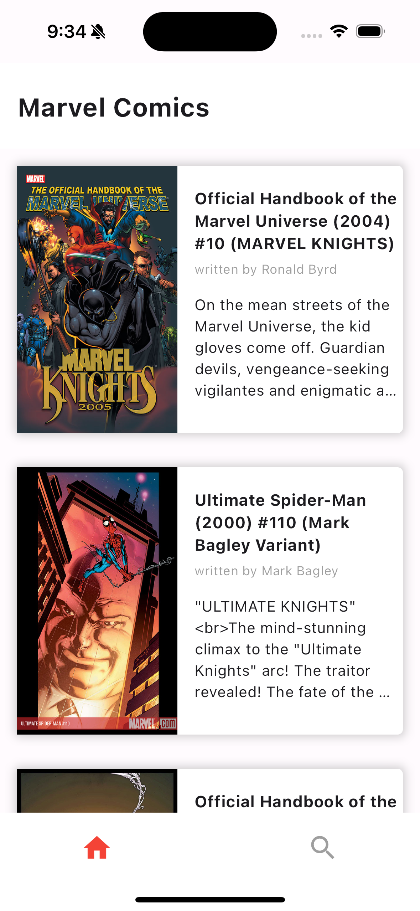
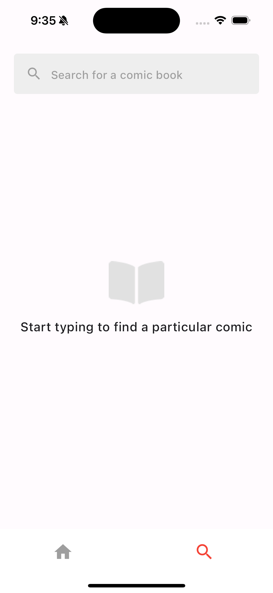
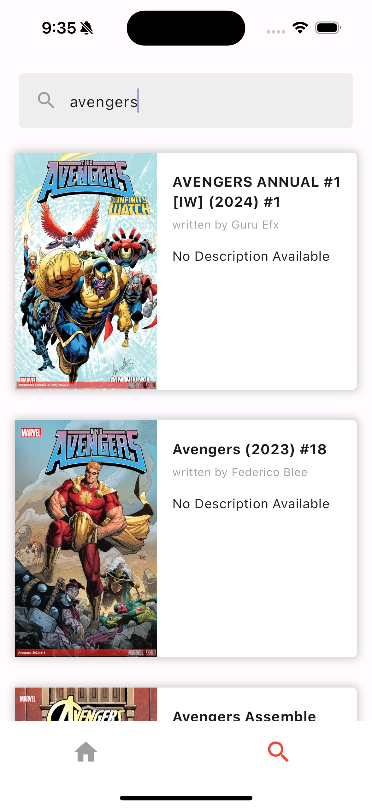
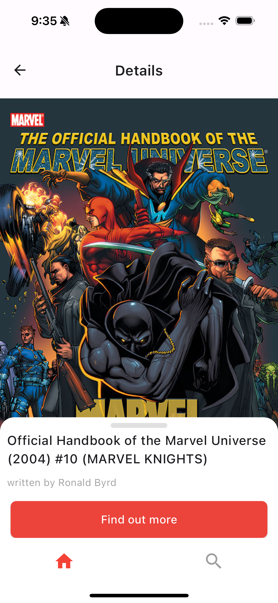
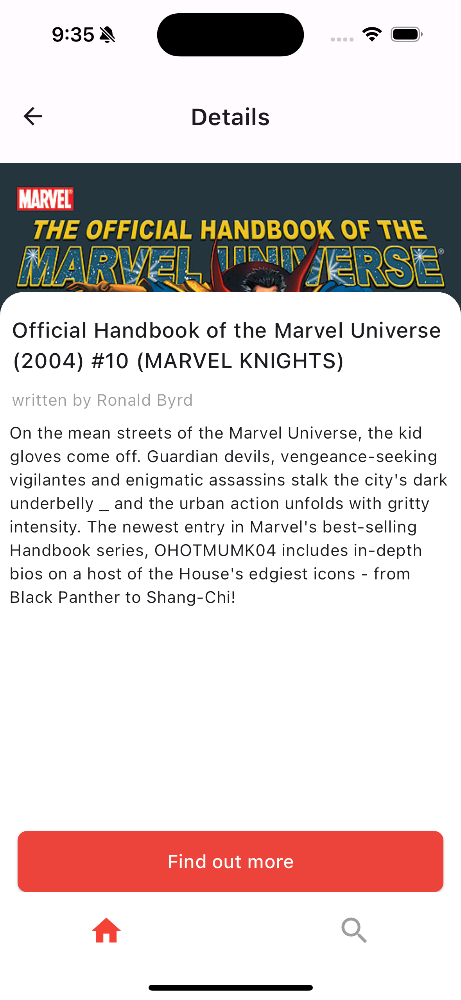

# Marvel Comics App

# HOW TO USE:

The application requires API keys to interact with the Marvel API. These keys should be stored in a `.env` file in the root of your project directory.

1. Create a `.env` file in the root of your project directory.
2. Add the following lines to the `.env` file:

   API_KEY=your_public_api_key
   PRIVATE_KEY=your_private_api_key

   Replace `your_public_api_key` and `your_private_api_key` with your actual Marvel API keys.

   # Screenshots

   ### Home Screen

   

   ### Search Screen

   
   

   ### Details Screen

   
   
